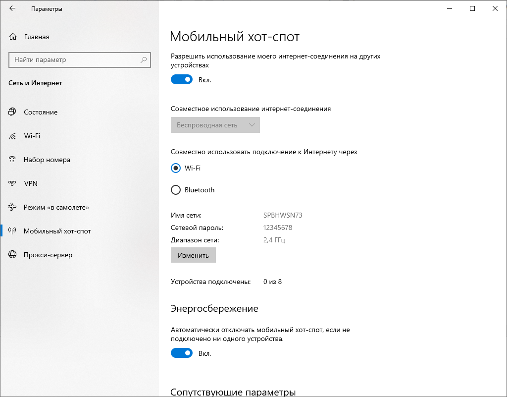
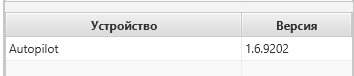
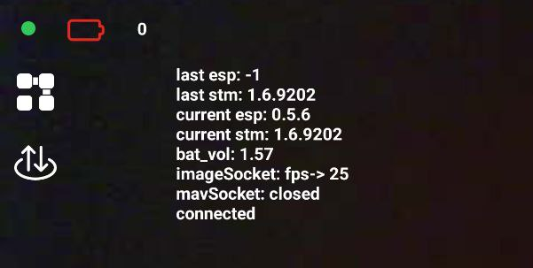
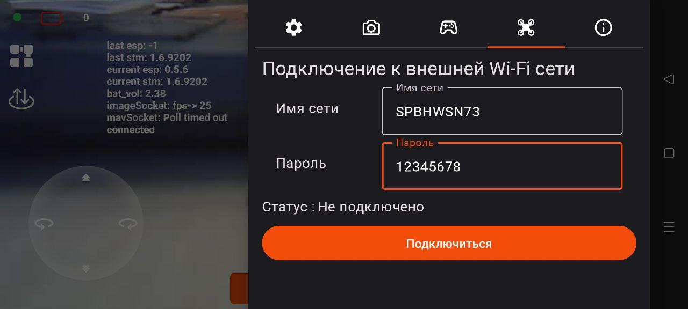

# Инструкция по запуску нескольких Пионеров Мини

Роевой полёт нескольких мини-дронов с одного управляющего компьютера.

## Необходимое оборудование

- Компьютер или ноутбук с Wi-Fi адаптером  
- 2 и более квадрокоптеров **Пионер-Мини** (максимум — 8 штук)  
- Смартфон на базе **Android 6+**

## Необходимое программное обеспечение

- [PyCharm](https://www.jetbrains.com/pycharm/) с установленной библиотекой `pioneer_sdk`  
- **Pioneer Station**  
- **Geoscan Jump** (установленное на смартфон)

## Настройка сети

1. Создайте точку доступа (хот-спот) на компьютере:
   - Имя сети и пароль **не должны содержать пробелов**
   - Используйте диапазон **2.4 ГГц**



## Подготовка квадрокоптеров

1. Убедитесь, что:
   - Прошивка АП: **1.6.9202**
   - Прошивка ESP: **0.5.6**
   - Загруженные параметры актуальны на всех квадрокоптерах
   
   

2. Для отображения актуальной прошивки автопилота и esp32 в приложении Geoscan Jump:
   - Включите отображение отладочной информации (`current_esp` и `current_stm`)
   
   

3. Включите квадрокоптер и подключитесь к нему через Geoscan Jump  
4. Перейдите в: **Настройки → Подключение к внешней Wi-Fi сети**  
5. Введите имя и пароль сети, нажмите **«Подключиться»**

   

6. В настройках хот-спота появится новое устройство с именем `espressif`  
7. Для ESP 0.5.6: статус может отображаться как «не подключено», требуется нажать «Подключиться» повторно  
8. Отключите смартфон от коптера — коптер должен остаться включённым 
9. Управляющий компьютер должен быть хот-спотом или тоже подключен к той же сети.
10. Повторите шаги 3–8 для всех квадрокоптеров. 
11. После подключения всех квадрокоптеров в настройках хот-спота будут отображаться все подключенные квадрокоптеры (в данном случае 3 шт).


## Запуск роя

1. Откройте PyCharm и загрузите скрипт роя  
2. В массиве IP-адресов укажите IP всех дронов

```python
drone_ips = ["192.168.1.101", "192.168.1.102", "192.168.1.103"]
```

3. Запустите скрипт  
4. При запросе взлёта — нажмите `Enter`  
5. После прилёта в начальную точку — снова `Enter` для начала маршрута  
6. Коптеры синхронно летают по координатам и затем садятся

## Прерывание выполнения

- Экстренная остановка:
  - Нажмите **красный квадратик** в PyCharm
  - Или сочетание клавиш **Ctrl+F2**

